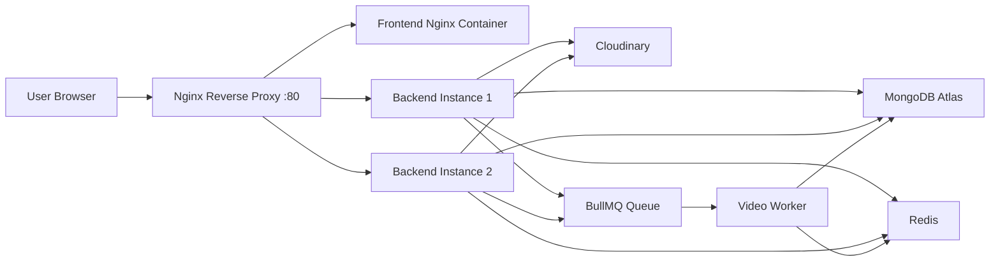

# Video Streaming Platform

A MERN-based video sharing platform with authentication, video uploads, playlists, comments, likes, subscriptions, search, notifications, caching, background jobs, Docker, Nginx, and CI.

## Features

- JWT authentication with access and refresh tokens
- Cloudinary-based video and thumbnail uploads
- Video feed with search, sorting, pagination, and recommendations
- Likes, comments, playlists, subscriptions, and watch history
- Notification system for new uploads from subscribed channels
- Redis caching for home feed and recommendations
- Redis-backed rate limiting with memory fallback
- BullMQ background jobs for async notification processing
- MongoDB aggregation pipelines and indexes
- Dockerized backend, frontend, Redis, worker, and Nginx gateway
- GitHub Actions CI for tests, builds, and Docker validation

## Tech Stack

- Frontend: React, Vite, Tailwind CSS
- Backend: Node.js, Express.js
- Database: MongoDB Atlas, Mongoose
- Cache/Queue: Redis, BullMQ
- Media Storage: Cloudinary
- Testing: Vitest, Supertest
- DevOps: Docker, Docker Compose, Nginx, GitHub Actions

## Architecture



# Project Documentation

## Request Flow

The application follows the request flow shown below:

1. User opens the application in the browser.
2. Nginx receives the request on **port 80**.
3. Frontend routes are served by the **Frontend Nginx container**.
4. API requests under `/api` are forwarded to the backend containers.
5. Nginx load balances requests across multiple backend instances.
6. Backend reads from and writes to **MongoDB Atlas**.
7. **Redis** is used for:
   - Caching
   - Rate limiting
   - BullMQ queues
8. **BullMQ workers** process asynchronous jobs such as upload notifications.

---

## Local Development

### Backend

```bash
cd "Backend aur Chai"
npm install
npm run dev
```

### Frontend

```bash
cd youtubeFrontend
npm install
npm run dev
```

### Redis

Run Redis locally using Docker:

```bash
docker run -d --name yt-redis -p 6379:6379 redis:7-alpine
```

---

## Docker Setup

### Start the Full Stack

```bash
docker compose up --build
```

### Stop All Containers

```bash
docker compose down
```

### Validate Docker Compose Configuration

```bash
docker compose config
```

---

## Testing

Run backend tests:

```bash
cd "Backend aur Chai"
npm test
```

### Test Coverage

The test suite covers:

- Health check behavior
- Authentication validation
- Protected routes
- Comment ownership
- Playlist ownership
- Video ownership
- Notification ownership
- Redis cache fallback
- BullMQ worker behavior
- Queue job creation
- Video publish controller behavior
- Search and recommendation behavior
- Rate limiter behavior
- Validation middleware behavior

---

## CI Pipeline

GitHub Actions automatically validates the following:

- Backend test suite
- Frontend production build
- Backend Docker image build
- Frontend Docker image build
- Docker Compose configuration

---

## Environment Variables

### Backend

```env
PORT=8000
MONGODB_URI=
CORS_ORIGIN=

ACCESS_TOKEN_SECRET=
ACCESS_TOKEN_EXPIRY=

REFRESH_TOKEN_SECRET=
REFRESH_TOKEN_EXPIRY=

CLOUDINARY_CLOUD_NAME=
CLOUDINARY_API_KEY=
CLOUDINARY_API_SECRET=

REDIS_URL=
CACHE_DEBUG=false
```

### Frontend

```env
VITE_API_BASE_URL=
```

---

## Scaling Notes

The application is designed to scale horizontally.

- Backend instances are **stateless** and can be replicated.
- **Nginx** load balances requests across backend containers.
- Session data is **not stored in server memory**.
- **Redis** acts as shared infrastructure for:
  - Caching
  - Rate limiting
  - BullMQ queues
- Background processing is handled by dedicated **BullMQ workers**, keeping long-running tasks outside the request-response lifecycle.

This architecture allows backend instances to be added or removed without affecting application state.